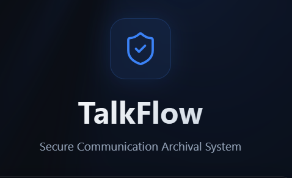

<div align="center">

# 🛡️ TalkFlow

### 🔐 Secure Communication Archival System


<br/>

[](https://talkflow-iota.vercel.app/)

[](https://talkflow-iota.vercel.app/)
[]


</div>

---

## ⚡ Overview

> **TalkFlow** is a security-first encrypted vault engineered to transform raw chat exports into a structured, searchable, and premium visual archive.

Traditional chat backups are:

* ❌ Plain text by default
* ❌ Difficult to analyse
* ❌ Insecure at rest

TalkFlow addresses these challenges through strong encryption, hardened authentication, and intelligent parsing.

---

## 🔐 Security Architecture

### 🧩 Encryption at Rest

* AES-256-CBC encryption before database persistence
* Encryption keys stored in environment variables
* Decryption only within authenticated controller layer

### 🔑 Stateless Authentication

* JWT stored in **HttpOnly Secure Cookies**
* Bcrypt hashing with strong salt rounds
* No LocalStorage token storage

### 🛡️ Backend Hardening

* Helmet.js secure HTTP headers
* Rate limiting on authentication and upload routes
* Input sanitisation to prevent NoSQL injection
* Secure file streaming with Multer

---

## 🧠 Intelligent Parsing Engine

* Regex detection for iOS & Android chat formats
* Multi-line message reconstruction
* System message classification
* Scroll-based calendar synchronisation
* Instant smart search across large datasets

---

## 🎨 Premium UI/UX

* Glassmorphism dark interface
* WebGL animated “Light Rays” background (OGL)
* Framer Motion transitions
* Fully responsive design

---

## 🛠️ Tech Stack

| Layer    | Technology                                   |
| -------- | -------------------------------------------- |
| Frontend | React.js, OGL (WebGL), Framer Motion, Lucide |
| Backend  | Node.js, Express.js                          |
| Database | MongoDB (Mongoose ORM)                       |
| Security | AES-256, Bcrypt, JWT, Helmet, Rate-Limit     |
| Styling  | Pure CSS3 (Variables, Flexbox, Grid)         |

---

## 🏗️ Engineering Philosophy

```
Assume Breach.
Encrypt by Default.
Minimise Attack Surface.
Visualise Intelligently.
```

TalkFlow demonstrates:

* Secure backend architecture
* Stateless authentication implementation
* Encryption lifecycle management
* Efficient handling of unstructured communication logs
* Production-grade API hardening

---

## 🚀 Local Setup

```bash
# Clone repository
git clone https://github.com/your-username/talkflow.git

# Install dependencies
npm install

# Configure environment variables
MONGO_URI=
JWT_SECRET=
ENCRYPTION_KEY=

# Start development server
npm run dev
```

---

<div align="center">

### 🔐 Secure. Structured. Sovereign.

</div>
